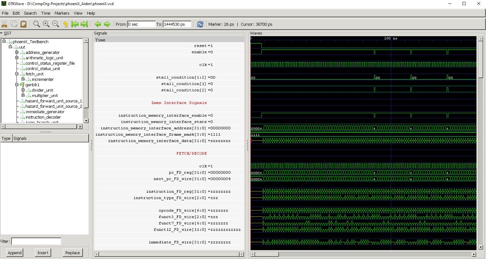
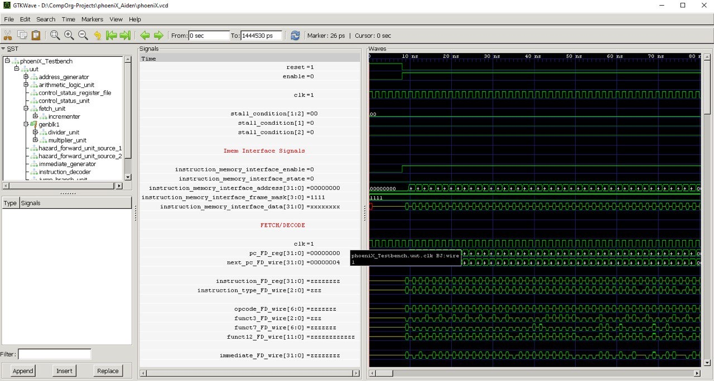
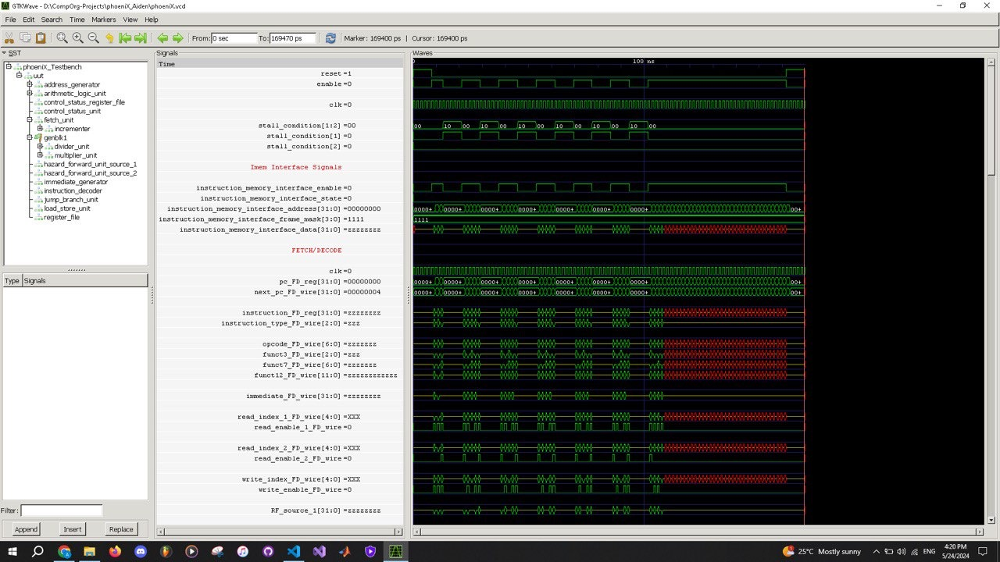
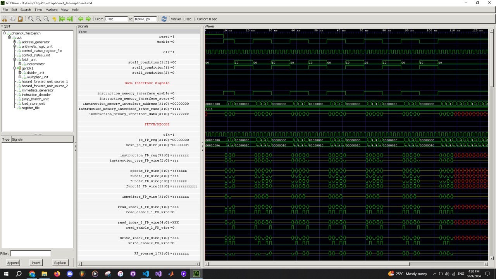

Computer Organization - Spring 2024

==============================================================

## Iran Univeristy of Science and Technology

## Assignment 1: Assembly code execution on phoeniX RISC-V core

- Name:Amir Mohammad Emam

- Team Members:Sara Dadkhoo , Matin Rahmati

- Student ID:400411144

- Date:1403/03/04

## Report

    *                *********** First Project ***********                *

A breakdown of what the code does:

1.  The code starts by allocating space on the stack for variables and saving necessary registers.

2.  It initializes an array with values (3, 5, 2, 1, 6, 4, 7) and sets up the parameters for the quicksort algorithm.

3.  It calls the quick_sort function using jal instruction.

4.  The quick_sort function starts by saving necessary registers on the stack and setting up variables.

5.  It checks if the end index is greater than the start index. If not, it jumps to the st_gt_end label.

6.  If the end index is greater than the start index, it calls the partition function to partition the array.

7.  After partitioning, it recursively calls quick_sort on the left and right sub-arrays.

8.  The partition function partitions the array based on a pivot element and swaps elements accordingly.

9.  Once the partitioning is complete, it returns to the quick_sort function.

10. Finally, after sorting is completed, it restores saved registers from the stack and returns to the main function to end the program.
    
    

        -                *********** Second Project ***********                *

11. **Loading the Input Integer**:

    `li a0, 25`: This instruction loads the input integer, in this case, 25, into register `a0`.
    This integer represents the value for which we want to find the integer square root.

12. **Initialize Result to 0**:
    `li t0, 0`: This instruction initializes the result to 0. The result register `t0` will be
    used to store the current guess for the integer square root.

13. **Loop for Computing the Square Root**:

    `loop:`: This label marks the beginning of the loop for computing the square root.
    `mul t1, t0, t0`: This instruction computes the square of the current result (`t0`) and
    stores it in register `t1`.
    `bge t1, a0, end`: This branch instruction checks if the squared result (`t1`) is greater
    than or equal to the input integer (`a0`). If true, the loop exits, and execution jumps
    to the `end` label.

    `addi t0, t0, 1`: If the condition is not met, this instruction increments the result (`t0`)
    by 1.

    `j loop`: This unconditional jump instruction jumps back to the beginning of the loop to repeat
    the process until the square of the current result exceeds or equals the input integer.

14. **End of Loop, Compute the Integer Square Root**:

    `end:`: This label marks the end of the loop.

    `addi t0, t0, -1`: This instruction subtracts 1 from the current result (`t0`) to obtain the
    integer square root. It's done by adding a negative immediate value to `t0`, effectively
    decrementing it by 1.

15. **Exit the Program**:

    `ebreak`: This instruction is used to terminate the program. When executed, it signals the
    end of the program to the simulator.

    In summary, the code iteratively computes the integer square root of the input integer by
    incrementing a guess (`t0`) until its square exceeds or equals the input. Then, it decrements
    the guess by 1 to obtain the integer square root and terminates the program.

